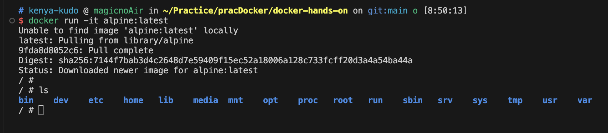
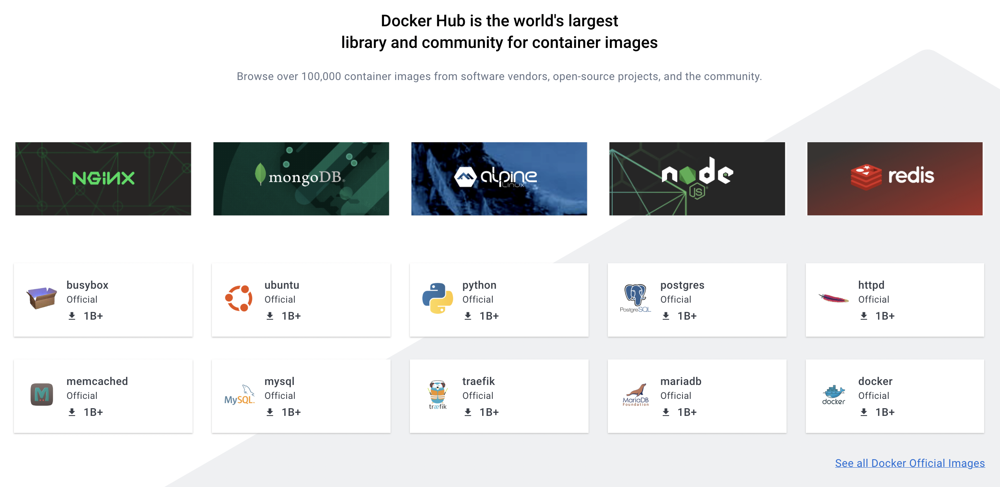

## docker run
https://docs.docker.jp/engine/reference/commandline/run.html
- >docker run コマンドは、まず指定されたイメージ上に書き込み可能なコンテナ・レイヤを create （作成）します。それから、指定されたコマンドを使って start （開始）します。この docker run は、 API の /containers/create の後で /containers/(id)/start を実行するのと同じです。以前に使っていたコンテナは docker start で再起動できます。全てのコンテナを表示するには docker ps -a を使います。

### docker run -it alpine:latestの意味
#### -it
- URL: https://docs.docker.jp/engine/reference/commandline/run.html#ruby-pseudo-tty-name-it
- >-it は疑似 TTY（pseudo-TTY）をコンテナの標準入力に接続するよう、 Docker に対して命令します。つまり、コンテナ内でインタラクティブな bash シェルを作成します。
- 確かにLinuxっぽいのが立ち上がってる
  - 

#### alpine:latest
- URL: https://hub.docker.com/_/alpine
- Alpine Linux をベースにした最小限の Docker イメージ。
- docker-alpine の メリット
  - サイズが最小限
  - ubuntu はやめてくださいみたいなこと書いてあって面白いw
- [Alpine Linux](https://alpinelinux.org/) は、 [musl libc](https://musl.libc.org/) および [BusyBox](https://www.busybox.net/) を中心に構築された Linux ディストリビューション
- [Alpine Linux](https://alpinelinux.org/)
  - キャッチコピーは Small. Simple. Secure. 本家もサイズの小ささとセキュリティを推している。
- [musl libc](https://musl.libc.org/)
  - >muslは、Linux システム コール API 上に構築された C 標準ライブラリの実装
  - >musl は軽量、高速、シンプル、無料であり、 標準への準拠と安全性の観点から正しくなるように努めています
  - こっちも Alpine Linux に似た設計思想ぽい
- [BusyBox](https://www.busybox.net/)
  - なんだこれは。全然わからん。
  - > BusyBox は、多くの一般的な UNIX ユーティリティの小さなバージョンを 1 つの小さな実行可能ファイルに結合します。
    - 一応これっぽい。
    - 出来るだけ小さな実行可能ファイルに結合する = ビルドツール？
  - > BusyBox は、あらゆる小規模システムまたは組み込みシステムにかなり完全な環境を提供します。
    - こっちも Alpine Linux に似た設計思想ぽい

## Docker Hub
- ってなんだ
- https://hub.docker.com/
- 公式 top: チームのコンテナ アプリケーションを作成、管理、配信するための世界で最も簡単な方法
- Docker Hub は、コンテナ イメージの世界最大の
ライブラリおよびコミュニティ
- 色々ある
  - 

### 【入門】Docker Hubとは？概要と仕組み、基本的な使い方を解説
- 参考URL: https://www.kagoya.jp/howto/cloud/container/dockerhub/
- >ユーザーはDocker Hubから任意のイメージを取得後、コンテナ化してすぐにいろいろなアプリケーションを利用可能
  - なるほど。なんとなく理解
- >Docker Hubには誰でも利用可能な公開リポジトリの他、非公開のプライベートリポジトリがあります。ユーザーは自分で作成したイメージをそれらリポジトリにアップロードし、他ユーザーと共有することも可能
  - これ、一回でも自分で作ってみるといいんだろうな。

- >Dockerイメージを共有・公開するサービス全体を「レジストリ」と呼ぶ
  - でたレジストリ
  - Azureでも見たワードだが、いまいちわかっていない
  - https://e-words.jp/w/%E3%83%AC%E3%82%B8%E3%82%B9%E3%83%88%E3%83%AA.html
    - >外部から情報の登録を受け付け、まとめて保管しておくシステムや機関のことを意味することが多い。
    - そのままの意味だった。ってことは、 Azure Container Registry もそのままいろんなイメージを保管するサービスを指しているのかな。

- >Docker Hubから取得（ダウンロード）したDockerイメージは、実行（run）することですぐにDockerコンテナとして利用できます。
  - まさに今 `docker run -it alpine:latest` でやったことだ。
