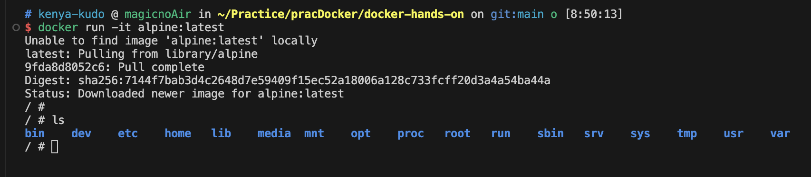

## docker run
https://docs.docker.jp/engine/reference/commandline/run.html
- 新しいコンテナでコマンドを 実行

### docker run -it alpine:latestの意味
#### -it
- URL: https://docs.docker.jp/engine/reference/commandline/run.html#ruby-pseudo-tty-name-it
- -it は疑似 TTY（pseudo-TTY）をコンテナの標準入力に接続するよう、 Docker に対して命令します。つまり、コンテナ内でインタラクティブな bash シェルを作成します。
- 確かにLinuxっぽいのが立ち上がってる
  - 

#### alpine:latest
- URL: https://hub.docker.com/_/alpine
- Alpine Linux をベースにした最小限の Docker イメージ。
- docker-alpine の メリット
  - サイズが最小限
  - ubuntu はやめてくださいみたいなこと書いてあって面白いw
- |[Alpine Linux](https://alpinelinux.org/) は、 |[musl libc](https://musl.libc.org/) および |[BusyBox](https://www.busybox.net/) を中心に構築された Linux ディストリビューション
- |[Alpine Linux](https://alpinelinux.org/)
  - キャッチコピーは Small. Simple. Secure. 本家もサイズの小ささとセキュリティを推している。
- |[musl libc](https://musl.libc.org/)
  - muslは、Linux システム コール API 上に構築された C 標準ライブラリの実装
  - musl は軽量、高速、シンプル、無料であり、 標準への準拠と安全性の観点から正しくなるように努めています
  - こっちも Alpine Linux に似た設計思想ぽい
- |[BusyBox](https://www.busybox.net/)
  - なんだこれは。全然わからん。
  - > BusyBox は、多くの一般的な UNIX ユーティリティの小さなバージョンを 1 つの小さな実行可能ファイルに結合します。
    - 一応これっぽい。
    - 出来るだけ小さな実行可能ファイルに結合する = ビルドツール？
  - > BusyBox は、あらゆる小規模システムまたは組み込みシステムにかなり完全な環境を提供します。
    - こっちも Alpine Linux に似た設計思想ぽい
